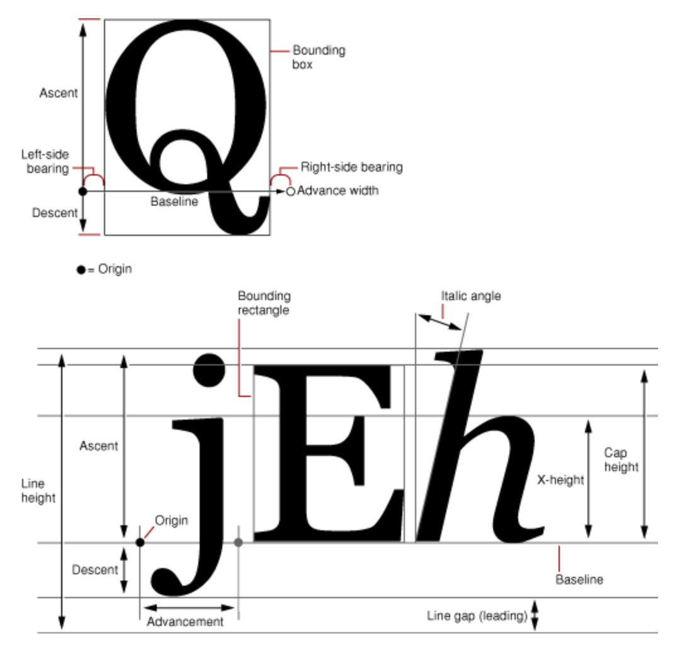

#### 可折叠Label

实现原理基于CoreText

如果要了解源码先了解一下CoreText的基本使用方法

\### CoreText的使用 

\#### 一、字形 

下面就来详情看看字形的各个参数也就是所谓的字形度量Glyph Metrics 



| 名称 | 功能说明 | 

| ----| --- | 

| Origin | 表示位于基线上的、一个字形在排列时基于基线的原点 | 

| Baseline | 表示字形在排列时,字形底部紧靠着的一条直线 | 

| Line height | 表示一行字形最大高度,等于Ascent 和 Decent(取其绝对值)及 Line gap(leading)三者之和 | 

| Ascent | 表示上行高度,是基线与字形最高点之间的距离 | 

| Descent | 表示下行调试,是基线与字形最低点之间的距离 | 

|Line gap(leading) | 表示行距,是上方一行的最低点与下方一行的最高点的距离 | 

| Advancement | 表示签好两个字形的原点之间的距离 | 

| Bounding rectangle | 能够容纳字形的最小矩形形框 | 

| Italic angle | 斜体字形在垂直方向上沿顺时针的倾斜角度 | 

| X-height | 基线至非突出的小写字母(如a、x、e等)最高点的距离 | 

| Cap height | 基线至大写字母最高点的距离 | 

**lineHeight = ascent + |descent| + leading** 

行高 = 上行高度 + 下行高度的绝对值 + 行间距 

\#### 二、坐标系 

传统的Mac中的坐标系的原点在左下角，比如NSView默认的坐标系，原点就在左下角。但Mac中有些View为了其实现的便捷将原点变换到左上角，像NSTableView的坐标系坐标原点就在左上角。 

iOS UIKit中，UIView是以左上角为原点，而Core Text一开始的定位是使用与桌面应用的排版系统，桌面应用的坐标系是以左下角为原点，即Core Text在绘制的时候也是参照左下角为原点进行绘制的，所以需要对当前的坐标系进行处理。 

实际上，Core Graphic 中的context也是以左下角为原点的， 但是为什么我们用Core Graphic 绘制一些简单的图形的时候不需要对坐标系进行处理呢，是因为通过这个方法UIGraphicsGetCurrentContext()来获得的当前context是已经被处理过的了，用下面方法可以查看指定的上下文的当前图形状态变换矩阵。 

\- 方法一 

\```objc 

//因为Core Text要配合Core Graphic 配合使用的，如Core Graphic一样，绘图的时候需要获得当前的上下文进行绘制 

CGContextRef context = UIGraphicsGetCurrentContext(); 

NSLog(@"当前context的变换矩阵 %@", NSStringFromCGAffineTransform(CGContextGetCTM(context))); 

//翻转当前的坐标系（因为对于底层绘制引擎来说，屏幕左下角为（0，0）） 

CGContextSetTextMatrix(context, CGAffineTransformIdentity);//设置字形变换矩阵为CGAffineTransformIdentity，也就是说每一个字形都不做图形变换 

CGAffineTransform flipVertical = CGAffineTransformMake(1,0,0,-1,0,self.bounds.size.height); 

CGContextConcatCTM(context, flipVertical);//将当前context的坐标系进行flip 

NSLog(@"翻转后context的变换矩阵 %@", NSStringFromCGAffineTransform(CGContextGetCTM(context))); 

\``` 

\- 方法二 

\``` objc 

//因为Core Text要配合Core Graphic 配合使用的，如Core Graphic一样，绘图的时候需要获得当前的上下文进行绘制 

CGContextRef context = UIGraphicsGetCurrentContext(); 

NSLog(@"当前context的变换矩阵 %@", NSStringFromCGAffineTransform(CGContextGetCTM(context))); 

//翻转当前的坐标系（因为对于底层绘制引擎来说，屏幕左下角为（0，0）） 

CGContextSetTextMatrix(context, CGAffineTransformIdentity);//设置字形变换矩阵为CGAffineTransformIdentity，也就是说每一个字形都不做图形变换 

CGAffineTransform flipVertical = CGAffineTransformMake(1,0,0,-1,0,self.bounds.size.height); 

CGContextConcatCTM(context, flipVertical);//将当前context的坐标系进行flip 

NSLog(@"翻转后context的变换矩阵 %@", NSStringFromCGAffineTransform(CGContextGetCTM(context))); 

\``` 

\#### CoreText相关类说明 

| CocreText类 | 类说明 | 

| --- | --- | 

| CTFramesetter |生成CTFrame的类型 | 

| CTFrame | 文本帧,包含多个CTLine | 

| CTLine |一行文本,一行文本包括多个属性不同的CTRun | 

| CTRun | 共享相同属性和方向的连续字形 | 

 

**CTFrame 作为一个整体的画布(Canvas)，其中由行(CTLine)组成，而每行可以分为一个或多个小方块（CTRun）** 

*注意：你不需要自己创建CTRun，Core Text将根据NSAttributedString的属性来自动创建CTRun。每个CTRun对象对应不同的属性，正因此，你可以自由的控制字体、颜色、字间距等等信息* 

\- NSAttributedString 

\```objc 

CGPathRef path = CGPathCreateWithRect(CGRectMake(0, 0, self.bounds.size.width, UIScreen.mainScreen.bounds.size.height), nil); 

NSMutableAttributedString *drawAttributedText1 = [[NSMutableAttributedString alloc] initWithAttributedString:_attributedText]; 

\``` 

\```objc 

CTFramesetterRef CTFramesetterCreateWithAttributedString(CFAttributedStringRef string) 

\``` 

\- CTFramesetter 

\```objc 

CTFramesetterRef setter = CTFramesetterCreateWithAttributedString((CFAttributedStringRef)drawAttributedText); 

\``` 

\- CTFrameRef 

\```objc 

CTFrameRef ctFrame = CTFramesetterCreateFrame(setter, CFRangeMake(0, drawAttributedText.length), path, NULL); 

\``` 

\- CTLines 

\```objc 

NSArray *lines = (NSArray*)CTFrameGetLines(ctFrame); 

\``` 

\- CTRunRef 

\```objc 

CTLineRef line = (__bridge CTLineRef)lines[i]; 

NSArray *runs = (NSArray*)CTLineGetGlyphRuns(line); 

\``` 