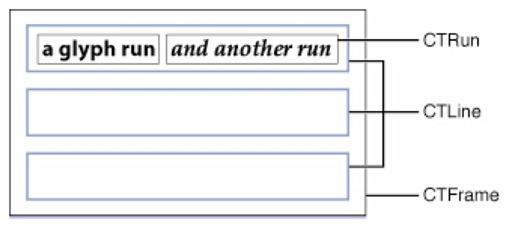

#### 可折叠Label

实现原理基于CoreText

如果要了解源码先了解一下CoreText的基本使用方法

### CoreText的使用 

#### 一、字形 

下面就来详情看看字形的各个参数也就是所谓的字形度量Glyph Metrics 


|        信息        |                             说明                             |
| :----------------: | :----------------------------------------------------------: |
|       Origin       |       表示位于基线上的、一个字形在排列时基于基线的原点       |
|      Baseline      |          表示字形在排列时,字形底部紧靠着的一条直线           |
|    Line height     | 表示一行字形最大高度,等于Ascent 和 Decent(取其绝对值)及 Line gap(leading)三者之和 |
|       Ascent       |          表示上行高度,是基线与字形最高点之间的距离           |
|      Descent       |          表示下行调试,是基线与字形最低点之间的距离           |
| Line gap(leading)  |     表示行距,是上方一行的最低点与下方一行的最高点的距离      |
|    Advancement     |               表示签好两个字形的原点之间的距离               |
| Bounding rectangle |                  能够容纳字形的最小矩形形框                  |
|    Italic angle    |            斜体字形在垂直方向上沿顺时针的倾斜角度            |
|      X-height      |       基线至非突出的小写字母(如a、x、e等)最高点的距离        |
|     Cap height     |                  基线至大写字母最高点的距离                  |

**lineHeight = ascent + |descent| + leading** 

行高 = 上行高度 + 下行高度的绝对值 + 行间距 

#### 二、坐标系 

传统的Mac中的坐标系的原点在左下角，比如NSView默认的坐标系，原点就在左下角。但Mac中有些View为了其实现的便捷将原点变换到左上角，像NSTableView的坐标系坐标原点就在左上角。 

iOS UIKit中，UIView是以左上角为原点，而Core Text一开始的定位是使用与桌面应用的排版系统，桌面应用的坐标系是以左下角为原点，即Core Text在绘制的时候也是参照左下角为原点进行绘制的，所以需要对当前的坐标系进行处理。 

实际上，Core Graphic 中的context也是以左下角为原点的， 但是为什么我们用Core Graphic 绘制一些简单的图形的时候不需要对坐标系进行处理呢，是因为通过这个方法UIGraphicsGetCurrentContext()来获得的当前context是已经被处理过的了，用下面方法可以查看指定的上下文的当前图形状态变换矩阵。 

- 方法一 

```objc
//因为Core Text要配合Core Graphic 配合使用的，如Core Graphic一样，绘图的时候需要获得当前的上下文进行绘制 

CGContextRef context = UIGraphicsGetCurrentContext(); 

NSLog(@"当前context的变换矩阵 %@", NSStringFromCGAffineTransform(CGContextGetCTM(context))); 

//翻转当前的坐标系（因为对于底层绘制引擎来说，屏幕左下角为（0，0）） 

CGContextSetTextMatrix(context, CGAffineTransformIdentity);//设置字形变换矩阵为CGAffineTransformIdentity，也就是说每一个字形都不做图形变换 

CGAffineTransform flipVertical = CGAffineTransformMake(1,0,0,-1,0,self.bounds.size.height); 

CGContextConcatCTM(context, flipVertical);//将当前context的坐标系进行flip 

NSLog(@"翻转后context的变换矩阵 %@", NSStringFromCGAffineTransform(CGContextGetCTM(context))); 
```

- 方法二 

```objc
//因为Core Text要配合Core Graphic 配合使用的，如Core Graphic一样，绘图的时候需要获得当前的上下文进行绘制 

CGContextRef context = UIGraphicsGetCurrentContext(); 

NSLog(@"当前context的变换矩阵 %@", NSStringFromCGAffineTransform(CGContextGetCTM(context))); 

//翻转当前的坐标系（因为对于底层绘制引擎来说，屏幕左下角为（0，0）） 

CGContextSetTextMatrix(context, CGAffineTransformIdentity);//设置字形变换矩阵为CGAffineTransformIdentity，也就是说每一个字形都不做图形变换 

CGAffineTransform flipVertical = CGAffineTransformMake(1,0,0,-1,0,self.bounds.size.height); 

CGContextConcatCTM(context, flipVertical);//将当前context的坐标系进行flip 

NSLog(@"翻转后context的变换矩阵 %@", NSStringFromCGAffineTransform(CGContextGetCTM(context))); 
```

 

#### CoreText相关类说明 

|  CocreText类  |                  类说明                  |
| :-----------: | :--------------------------------------: |
| CTFramesetter |            生成CTFrame的类型             |
|    CTFrame    |          文本帧,包含多个CTLine           |
|    CTLine     | 一行文本,一行文本包括多个属性不同的CTRun |
|     CTRun     |       共享相同属性和方向的连续字形       |



**CTFrame 作为一个整体的画布(Canvas)，其中由行(CTLine)组成，而每行可以分为一个或多个小方块（CTRun）** 

*注意：你不需要自己创建CTRun，Core Text将根据NSAttributedString的属性来自动创建CTRun。每个CTRun对象对应不同的属性，正因此，你可以自由的控制字体、颜色、字间距等等信息* 

#####  NSAttributedString 

```objc
CGPathRef path = CGPathCreateWithRect(CGRectMake(0, 0, self.bounds.size.width, UIScreen.mainScreen.bounds.size.height), nil); 

NSMutableAttributedString *drawAttributedText1 = [[NSMutableAttributedString alloc] initWithAttributedString:_attributedText]; 
```

```objc 
CTFramesetterRef CTFramesetterCreateWithAttributedString(CFAttributedStringRef string) 
```

##### CTFramesetter 

```objc
CTFramesetterRef setter = CTFramesetterCreateWithAttributedString((CFAttributedStringRef)drawAttributedText);  
```

- ###### 通过属性字符串创建CTFramesetterRef对象

###### `CTFramesetterRef CTFramesetterCreateWithAttributedString(CFAttributedStringRef string);`

- ###### CTFramesetterRef对象创建帧对象(CTFrameRef)

`CTFrameRef CTFramesetterCreateFrame(CTFramesetterRef framesetter, CFRange stringRange, CGPathRef path, CFDictionaryRef frameAttributes);`

- ###### 获得推荐的文本尺寸大小

```objc
CGSize CTFramesetterSuggestFrameSizeWithConstraints(CTFramesetterRef framesetter, CFRange stringRange, CFDictionaryRef frameAttributes, CGSize constraints, CFRange *fitRange);
```

##### CTFrameRef 

```objc
CTFrameRef ctFrame = CTFramesetterCreateFrame(setter, CFRangeMake(0, drawAttributedText.length), path, NULL); 
```

- ###### 通过`CTFrameRef`帧率获得行数`CTLineRef`对象

```objc
CFArrayRef CTFrameGetLines(CTFrameRef frame);
```

- ###### 通过帧率获取每行的位置 

Orgings 传的是指针 所以该参数定义成`CGPoint origins = [lines.count]` `lines`是行数

```objc
void CTFrameGetLineOrigins(CTFrameRef frame, CFRange range, CGPoint *origins);
```

##### CTLines 

```objc
NSArray *lines = (NSArray*)CTFrameGetLines(ctFrame); 
```

- ###### 获取该行包含的`CTRunRef`

```objc
CFArrayRef CTLineGetGlyphRuns(CTLineRef line);
```

- ###### 通过属性字符串创建`CTLineRef`对象

```objc
CTLineRef CTLineCreateWithAttributedString(CFAttributedStringRef attrString)
```

- ###### 获取行所在的下标位置

```objc
CFIndex CTLineGetGlyphCount(CTLineRef line);
```

- ###### 获取该行在整个文本帧的位置

```objc
CFRange CTLineGetStringRange(CTLineRef line);
```

- ###### 获取改行的上行高、下行高、行间距(行高)

```objc
//行高 lineHeightErrorDimension误差 可以为0  lineSpace 设置的行间距
-(CGFloat)heightForCTLine: (CTLineRef)line{
	CGFloat h = 0;
    CGFloat ascent;
    CGFloat descent;
    CGFloat leading;
    CTLineGetTypographicBounds(line, &ascent, &descent, &leading);
    h = MAX(h, ascent + descent + leading);
	return h + _lineHeightErrorDimension + self.lineSpace;
}
```

```objc

//行间距的设置方式
- (void)addGlobalAttributeWithContent:(NSMutableAttributedString *)aContent font:(UIFont *)aFont
{
    CGFloat lineLeading = self.lineSpace; // 行间距
    
    const CFIndex kNumberOfSettings = 2;
//    //设置段落格式
//    CTParagraphStyleSetting lineBreakStyle;
//    CTLineBreakMode lineBreakMode = kCTLineBreakByWordWrapping;
//    lineBreakStyle.spec = kCTParagraphStyleSpecifierLineBreakMode;
//    lineBreakStyle.valueSize = sizeof(CTLineBreakMode);
//    lineBreakStyle.value = &lineBreakMode;
    
    //设置行距
    CTParagraphStyleSetting lineSpaceStyle;
    CTParagraphStyleSpecifier spec;
    spec = kCTParagraphStyleSpecifierLineSpacingAdjustment;
    lineSpaceStyle.spec = spec;
    lineSpaceStyle.valueSize = sizeof(CGFloat);
    lineSpaceStyle.value = &lineLeading;
    
    // 结构体数组
    CTParagraphStyleSetting theSettings[kNumberOfSettings] = {
        lineSpaceStyle,
    };
    CTParagraphStyleRef theParagraphRef = CTParagraphStyleCreate(theSettings, kNumberOfSettings);
    
    // 将设置的行距应用于整段文字
    [aContent addAttribute:NSParagraphStyleAttributeName value:(__bridge id)(theParagraphRef) range:NSMakeRange(0, aContent.length)];
    
//    CFStringRef fontName = (__bridge CFStringRef)aFont.fontName;
//    CTFontRef fontRef = CTFontCreateWithName(fontName, aFont.pointSize, NULL);
//    // 将字体大小应用于整段文字
//    [aContent addAttribute:NSFontAttributeName value:(__bridge id)fontRef range:NSMakeRange(0, aContent.length)];
//
//    // 给整段文字添加默认颜色
//    [aContent addAttribute:NSForegroundColorAttributeName value:[UIColor blackColor] range:NSMakeRange(0, aContent.length)];
    // 内存管理
    CFRelease(theParagraphRef);
//    CFRelease(fontRef);
}
```


```objc
double CTLineGetTypographicBounds(CTLineRef line, CGFloat *ascent, CGFloat *descent, CGFloat *leading);
```


##### CTRunRef 

```objc
CTLineRef line = (__bridge CTLineRef)lines[i]; 

NSArray *runs = (NSArray*)CTLineGetGlyphRuns(line); 
```

- ###### 获取改行的CTRun块在该行的下标位置

```objc
CFIndex CTRunGetGlyphCount(CTRunRef run);
```

- ###### 获取该行的CTRun块在的物理坐标位置

```objc
const CGPoint * CTRunGetPositionsPtr(CTRunRef run);
```

- ###### 获取改CTRun块的宽度 返回值是边界宽度

```
double CTRunGetTypographicBounds(CTRunRef run, CFRange range, CGFloat *ascent, CGFloat *descent, CGFloat *leading);
```

